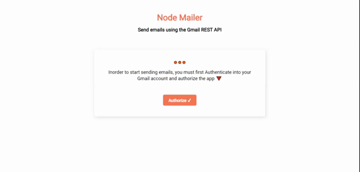

# node-mailer
NodeJS and Express based API service to send emails using the Gmail REST API


Used a simple HTML-CSS-JS based Client to access the node API.

## App Flow

1. The user first has to authorize the node-server so that it can access user credentials to send emails on user's behalf. To do so the user has to navigate to `/api/auth/google` route. This will redirect the user to Google Oauth2 Consent Screen to get his/her approval. 

2. After authorization, Google redirects the request to `/api/auth/google/callback` on the node-server along with the requested user credentials.

3. The node-server then redirects the user to *`/message` route on the Client* passing along a unique cookie to identify the user on subsequent requests.

4. Now once the user is authenticated, to send a new email, the user makes a **POST** request to `/api/message/send` endpoint along with the required data.


## Endpoints

1. **GET `/api/auth/google`** \
   For user authentication and Authorization.

2. **GET `/api/auth/google/callback`** \
   The callback route to which Google redirects to with user credentials.

3. **GET `/api/auth/current_user`** \
   To check whether the user is Authenticated or not.

4. **POST `/api/message/send`** \
   To send emails using the Gmail API. \
   *Request body*
   ```json
   {
       "to": "Receiver's Email Address",
       "subject": "Subject of the email",
       "emailBody": "Email content" 
   }
   ```

## To run locally

1. Clone the repo and install the required dependencies
   
   ```bash
   $ git clone https://github.com/RajKotadia/node-mailer.git
   $ cd node-mailer
   $ npm i
   ```
2. Create a new Google Project on Google Developer Console; enable the Gmail API and setup the OAuth2 Client.

3. Create a `.env` file in the project root and add Google Project Credentials following the `.env.sample` file.
   
4. Run the development server locally  on `http://localhost:1337` using -  
   ```bash
   $ npm run dev
   ```